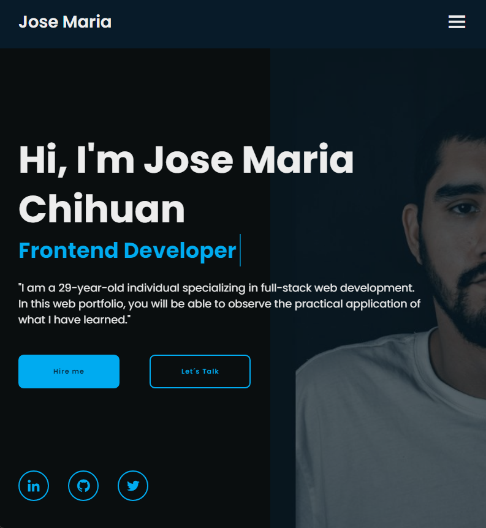
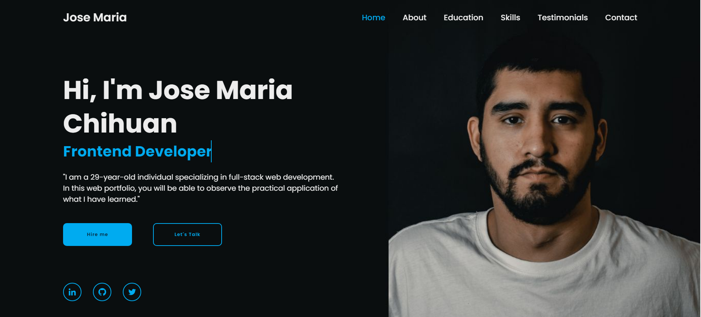

# Portafolio Personal - Jose Maria

¡Bienvenido a mi portafolio personal!

Este es un proyecto que he creado para mostrar mi trabajo y habilidades como desarrollador web. En este portafolio, encontrarás información sobre mí y cómo contactarme.

## Características

- **HTML5:** El contenido está estructurado semánticamente utilizando las últimas prácticas de HTML5.
- **CSS:** Estilos cuidadosamente diseñados para una apariencia atractiva y responsiva en diferentes dispositivos.
- **JavaScript:** Funcionalidades interactivas implementadas con JavaScript para mejorar la experiencia del usuario.
- **Diseño Responsivo:** El portafolio está diseñado para ser completamente receptivo, asegurando una experiencia óptima en dispositivos móviles y de escritorio.
- **Habilidades:** Destaco algunas de mis habilidades más relevantes para que los visitantes puedan tener una visión general.
- **Formulario de Contacto:** Incluyo un formulario de contacto para que los interesados puedan ponerse en contacto conmigo fácilmente.

## Tecnologías Utilizadas

- HTML5
- CSS
- JavaScript

## Uso

1. Clona este repositorio en tu máquina local.
2. Abre el archivo `webportafolio.html` en tu navegador web.
3. Explora mi portafolio y proyectos.
4. Si deseas contactarme, utiliza el formulario de contacto proporcionado.

## Capturas de Pantalla

## Contacto

Si tienes alguna pregunta, comentario o simplemente quieres decir hola, no dudes en ponerte en contacto conmigo.

- **Nombre:** [Jose Maria]
- **Correo Electrónico:** [josemariabion@hotmail.com]

¡Gracias por visitar mi portafolio!
